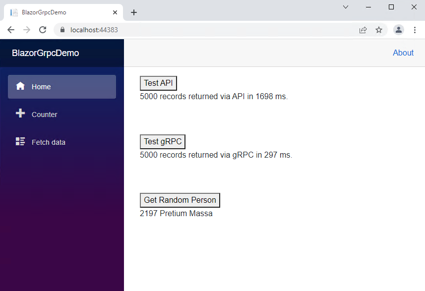
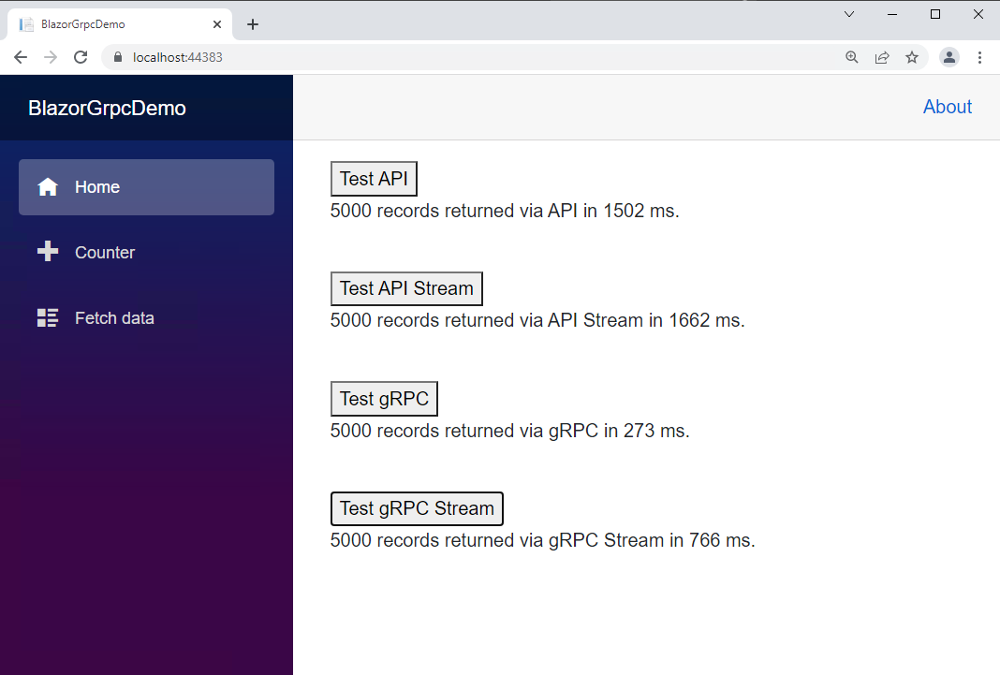
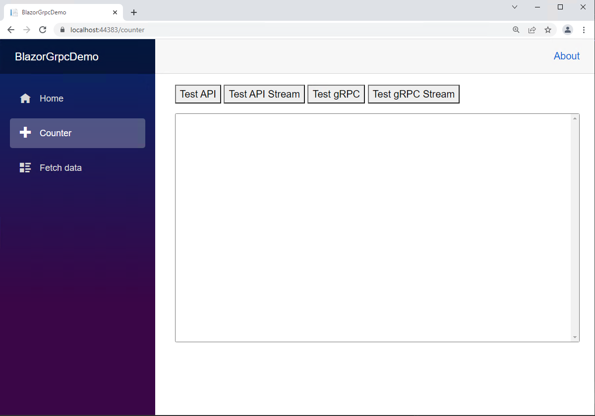
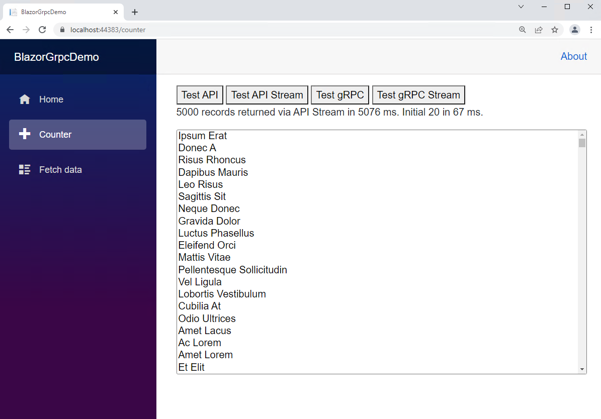

# Streaming Three Ways (SignalR, REST, and gPRC)

This repo and documentation compares performance and scalability of streaming with SignalR, REST, and gRPC in a .NET 7 Hosted Blazor WebAssembly App

For a .NET 8 demo, go to https://github.com/carlfranklin/BlazorStreamingDemo8

### Overview

Before we talk about Blazor, SignalR, REST, or gRPC, let's talk about streaming.

##### Streaming is not System.IO.Stream

Streaming is more about the `yeild` keyword than about anything in the `System.IO` namespace.

Streaming is the use of the Iterator pattern to return one item at a time from an IEnumerable method.

Create a new console app and replace *Program.cs* with the following:

```c#
// STREAMING has nothing to do with STREAMS
// Streaming uses the Iterator pattern

// retrieve a sequence of messages
var Messages = GetMessages();

// display the messages
foreach (var msg in Messages)
{
    Console.WriteLine(msg.Text);
}

// and we're done
Console.WriteLine("Done");

// method to return data.
// imagine this is coming from a database or some other source
IEnumerable<Message> GetMessages()
{
    var messages = new List<Message>();
    for (int i = 0; i < 3; i++) 
    {
        var msg = new Message() { Text = $"Hello {i}" };
        messages.Add(msg);
    }
    return messages;
}

public class Message
{
    public string? Text { get; set; }
}
```

This code does not stream. `GetMessage()` returns a complete list after being filled up. Stepping through the code line by line will reveal how it works. This is our starting point.

Now let's turn it into a streaming demo. Replace with this code:

```c#
// STREAMING has nothing to do with STREAMS
// Streaming uses the Iterator pattern

// retrieve a sequence of messages
var Messages = GetMessages();

// display the messages
foreach (var msg in Messages)
{
    Console.WriteLine(msg.Text);
}

// and we're done
Console.WriteLine("Done");

// method to return data.
// imagine this is coming from a database or some other source
IEnumerable<Message> GetMessages()
{
    //var messages = new List<Message>();
    for (int i = 0; i < 3; i++) 
    {
        var msg = new Message() { Text = $"Hello {i}" };
        yield return msg;
        //messages.Add(msg);
    }
    //return messages;
}

public class Message
{
    public string? Text { get; set; }
}
```

I have uncommented the lines in `GetMessages()`, which has the same signature as before. Instead of returning an entire `List<Message>` we are using the `yield` keyword to return one item at a time.

Stepping through the code, you can see that the code pointer blows right over the call to `GetMessages()`, and once the code hits `yield return msg`; the code pointer immediately jumps back to ` Console.WriteLine(msg.Text);` effectively pulling out one `Message` object at a time, and eliminating the need to return a complete `List<Message>`.

This is streaming.

Streaming means using the Iterator pattern with `yield return`

Streaming does not mean using `System.IO` constructs like `FileStream`, `MemoryStream`, `NetworkStream`, etc.

There are situations where you can even re-use a single object to provide a stream, to reduce memory pressure. 

Change the `GetMessages()` method to this:

```c#
IEnumerable<Message> GetMessages()
{
    var msg = new Message();
    for (int i = 0; i < 3; i++) 
    {
        msg.Text = $"Hello {i}";
        yield return msg;
    }
}
```

This works when you run it, but ***BEWARE!*** There be dragons!

Everything is fine if you only iterate once over the returned set, but watch what happens when we iterate twice, like so:

```c#
// STREAMING has nothing to do with STREAMS
// Streaming uses the Iterator pattern

// retrieve a sequence of messages
var Messages = GetMessages();

// display the messages
foreach (var msg in Messages)
{
    Console.WriteLine(msg.Text);
}
 
// display the messages AGAIN
foreach (var msg in Messages)	// put a breakpoint here
{
    Console.WriteLine(msg.Text);
}

// and we're done
Console.WriteLine("Done");

// method to return data.
// imagine this is coming from a database or some other source
IEnumerable<Message> GetMessages()
{
    var msg = new Message();
    for (int i = 0; i < 3; i++) 
    {
        msg.Text = $"Hello {i}";
        yield return msg;
    }
}

public class Message
{
    public string? Text { get; set; }
}
```

Once you hit the second iteration, The `GetMessage()` method is called again. 

> **TIP:** If you are only iterating over the result set once, you can save memory by re-using the same object before calling `return yield;`

The `yield` statement has been in .NET since version 2.0! That's how long we've been able to stream. So what's different now?

#### Async Streaming

C# 8 (ASP.NET Core 3.0) introduced Async streaming with `IAsyncEnumerable<T>` which combines the Iterator pattern with async code.

Without Async streaming using`IAsyncEnumerable<T>` you cannot call `yield return` in an async method.

Because it's async, your UI can start working as soon as the first record arrives. 

Async streaming is a pull operation, not a push operation.

Also, async streaming is not about performance. It's about scalability.

Let's change our code to use async streaming:

```c#
// Async Streaming uses the Iterator pattern
// (yield return) WITH async!

// Without async streams, you can NOT do yield return
// from an async method.

// Because it's async, your UI can start working
// as soon as the first record arrives.

// async streaming is a PULL operation, not a PUSH.

// Async streaming is NOT about performance.
// It's about scalability.

// display messages using 'await foreach'
await foreach (var msg in GetMessages())
{
    Console.WriteLine(msg.Text);
}

// and we're done
Console.WriteLine("Done");

// IAsyncEnumerable is a ValueTask, not a Task
// ValueTask should be used when lots of data is
// to be streamed and therefore memory needs to 
// be conserved. ValueTask creates 0 Gen 1 allocations
// whereas Task creates Gen 1 allocations.
async IAsyncEnumerable<Message> GetMessages()
{
    // just to have something async in here!
    await Task.Delay(0);

    for (int i = 0; i < 3; i++) 
    {
        var msg = new Message() { Text = $"Hello {i}" };
        yield return msg;
    }
}

public class Message
{
    public string? Text { get; set; }
}
```

`IAsyncEnumerable` is a ValueTask, so you don't need to use it inside a Task. It IS a task. 

This code also uses `await foreach`, a subtle difference from calling `await GetMessages()`

Step through the code and you will see that it's the same flow as the streaming code we just ran, but now since it's being called asynchronously, the UI can start showing data as soon as the first object arrives. That will make a big difference when we start streaming to a Blazor client.

## SignalR

We're going to start our Blazor Streaming demos with SignalR just because it's the easiest to set up and get running right away. Also, SignalR has an old way and a new way to stream, so it's a bit of a different animal than a REST API or gRPC service.

Create a Blazor Server app called *SignalRStreamingDemo* and add the following to the .csproj file:

```xml
<ItemGroup>
    <PackageReference Include="Microsoft.AspNetCore.SignalR.Client" Version="6.0.3" />
</ItemGroup>
```

SignalR server-side code (Hubs) is built into ASP.NET, but we need this library in order to call into the hub from Blazor.

Now open *Program.cs* and change it to the following:

```c#
global using Microsoft.AspNetCore.Components;
global using Microsoft.AspNetCore.Components.Web;
global using Microsoft.AspNetCore.SignalR;
global using System.Runtime.CompilerServices;
global using System.Threading.Channels;
using Microsoft.AspNetCore.ResponseCompression;

var builder = WebApplication.CreateBuilder(args);

// Add services to the container.
builder.Services.AddRazorPages();
builder.Services.AddServerSideBlazor();

// Added these two for SignalR Demo
builder.Services.AddSignalR();
builder.Services.AddResponseCompression(opts =>
{
    opts.MimeTypes = ResponseCompressionDefaults.MimeTypes.Concat(
        new[] { "application/octet-stream" });
});

var app = builder.Build();

// Added for SignalR Demo
app.UseResponseCompression();

// Configure the HTTP request pipeline.
if (!app.Environment.IsDevelopment())
{
    app.UseExceptionHandler("/Error");
    // The default HSTS value is 30 days. You may want to change this for production scenarios, see https://aka.ms/aspnetcore-hsts.
    app.UseHsts();
}

app.UseHttpsRedirection();

app.UseStaticFiles();

app.UseRouting();

app.MapBlazorHub();

// Added for SignalR Demo
app.MapHub<StreamHub>("/StreamHub");

app.MapFallbackToPage("/_Host");

app.Run();
```

We've added some `global using` statements for namespaces we're going to need in the app.

We've also added `builder.Services.AddSignalR();` and support for response compression. 

We've also added `app.MapHub<StreamHub>("/StreamHub");` to map our hub, which we will now create.

Add *StreamHub.cs* to the project:

```c#
public class StreamHub : Hub
{
    // This code was adapted from the following documentation:
    // https://docs.microsoft.com/en-us/aspnet/core/signalr/streaming?view=aspnetcore-6.0

    /* 
      A channel is simply a data structure that’s used to store 
      produced data for a consumer to retrieve, and an appropriate 
      synchronization to enable that to happen safely, while also 
      enabling appropriate notifications in both directions.
      Ref: https://devblogs.microsoft.com/dotnet/an-introduction-to-system-threading-channels/
     
      The Channel method has been available since ASP.NET Core 2.1
     
      ASP.NET Core 3.0 introduced streaming from the client to the server.

      C# 8 introduced asynchronous streaming using IAsyncEnumerable, available
      in .NET Core 3.0 +
     */

    #region "Stream channel to client"
    public ChannelReader<int> GetChannelStream(
        int count,
        int delay,
        CancellationToken cancellationToken)
    {
        var channel = Channel.CreateBounded<int>(10);

        // The underscore _ is a "discard", declaring your intent to
        // ignore the return value. It's the polite thing to do.
        // Ref: https://docs.microsoft.com/en-us/dotnet/csharp/fundamentals/functional/discards

        // We don't want to await WriteItemsAsync, otherwise we'd end up waiting 
        // for all the items to be written before returning the channel back to
        // the client.

        _ = WriteItemsAsync(channel.Writer, count, delay, cancellationToken);

        return channel.Reader;
    }

    private async Task WriteItemsAsync(
        ChannelWriter<int> writer,
        int count,
        int delay,
        CancellationToken cancellationToken)
    {
        // Use the "damn-it" operator (!) to appease the compiler
        // Ref: https://codeblog.jonskeet.uk/category/c-8/
        Exception localException = null!;
        try
        {
            for (var i = 0; i < count; i++)
            {
                await writer.WriteAsync(i, cancellationToken);

                // Use the cancellationToken in other APIs that accept cancellation
                // tokens so the cancellation can flow down to them.

            // https://docs.microsoft.com/en-us/dotnet/standard/threading/cancellation-in-managed-threads

                await Task.Delay(delay, cancellationToken);
            }
        }
        catch (Exception ex)
        {
            localException = ex;
        }
        finally
        {
            writer.Complete(localException);
        }
    }
    #endregion

    #region "Stream async stream to client"
    public async IAsyncEnumerable<int> GetAsyncStream(
        int count,
        int delay,
        [EnumeratorCancellation]
        CancellationToken cancellationToken)
    {
        for (var i = 0; i < count; i++)
        {
            // Check the cancellation token regularly so that the server will stop
            // producing items if the client disconnects.
            cancellationToken.ThrowIfCancellationRequested();

            yield return i;

            // Use the cancellationToken in other APIs that accept cancellation
            // tokens so the cancellation can flow down to them.
            await Task.Delay(delay, cancellationToken);
        }
    }
    #endregion

    #region "Receive channel stream from client"
    public async Task UploadStreamToChannel(ChannelReader<string> stream)
    {
        while (await stream.WaitToReadAsync())
        {
            while (stream.TryRead(out var item))
            {
                await Clients.All.SendAsync("ReceiveChannelStreamData", item);
            }
        }
    }
    #endregion

    #region "Receive async stream from client"
    // Streaming from client to server using newer Async Stream
    public async Task UploadAsyncStream(IAsyncEnumerable<string> stream)
    {
        await foreach (var item in stream)
        {
            await Clients.All.SendAsync("ReceiveAsyncStreamData", item);
        }
    }
    #endregion

}
```

This hub was adapted from the documentation at https://docs.microsoft.com/en-us/aspnet/core/signalr/streaming?view=aspnetcore-6.0

**Channels**

There are two ways to stream with SignalR, using **channels** (the old way) or **async streaming** (new and shiny).

A channel is a data structure that’s used to store produced data for a consumer to retrieve, and an appropriate       synchronization to enable that to happen safely, while also enabling appropriate notifications in both directions.

Channels have been around since ASP.NET Core 2.1

You can read more about channels at https://devblogs.microsoft.com/dotnet/an-introduction-to-system-threading-channels/

Check out `GetChannelStream()`:

```c#
public ChannelReader<int> GetChannelStream(
    int count,
    int delay,
    CancellationToken cancellationToken)
{
    var channel = Channel.CreateBounded<int>(10);

    // The underscore _ is a "discard", declaring your intent to
    // ignore the return value. It's the polite thing to do.
    // Ref: https://docs.microsoft.com/en-us/dotnet/csharp/fundamentals/functional/discards

    // We don't want to await WriteItemsAsync, otherwise we'd end up waiting 
    // for all the items to be written before returning the channel back to
    // the client.

    _ = WriteItemsAsync(channel.Writer, count, delay, cancellationToken);

    return channel.Reader;
}
```

`GetChannelStream` returns a `ChannelReader<int>` 

Keep in mind this is happening in a Hub. A client will call this, return the `ChannelReader` and iterate through the data. 

**Bounded vs Unbounded Channels**

A bounded channel has a finite number of elements that can be transmitted. Use it if you know the number of items before streaming.

An unbounded channel is open-ended, and won't stop making data available until the `CancellationToken` is used to stop the transmission.

For clarity's sake, I have separated out the code that actually does the transmitting into a method called `WriteItemsAsync()`:

```c#
private async Task WriteItemsAsync(
    ChannelWriter<int> writer,
    int count,
    int delay,
    CancellationToken cancellationToken)
{
    // Use the "damn-it" operator (!) to appease the compiler
    // Ref: https://codeblog.jonskeet.uk/category/c-8/
    Exception localException = null!;
    try
    {
        for (var i = 0; i < count; i++)
        {
            await writer.WriteAsync(i, cancellationToken);

            // Use the cancellationToken in other APIs that accept cancellation
            // tokens so the cancellation can flow down to them.

            // https://docs.microsoft.com/en-us/dotnet/standard/threading/cancellation-in-managed-threads

            await Task.Delay(delay, cancellationToken);
        }
    }
    catch (Exception ex)
    {
        localException = ex;
    }
    finally
    {
        writer.Complete(localException);
    }
}
```

This code simply writes a series of integers to the channel in a loop, with a delay between each one. The count and the delay are ultimately passed in by the client. 

If it seems like a lot of work, you're right to assume. It is, but before C# 8, this is what we had.

#### **Client Code** 

Before we run any Blazor code, let's add this statement to *_Imports.razor*

```
@using Microsoft.AspNetCore.SignalR.Client
```

Now, change the contents of *Index.razor* to the following:

```c#
@page "/"
@inject NavigationManager NavigationManager

<PageTitle>Index</PageTitle>

<button @onclick="GetChannelStream">@channelButtonText</button>
<br />
<div>@channelMessage</div>
<br />

<button @onclick="GetAsyncStream">@asyncButtonText</button>
<br />
<div>@asyncMessage</div>
<br />

<button @onclick="StreamChannelToServer">@sendChannelButtonText</button>
<br />
<div>@receiveChannelMessage</div>
<br />

<button @onclick="StreamAsyncToServer">@sendAsyncButtonText</button>
<br />
<div>@receiveAsyncMessage</div>
<br />

@code
{
    // Make objects nullable.
    // Check out The .NET Show episode 15 "It's a Nullable World"
    // at https://thedotnetshow.com
    private HubConnection? hubConnection;

#region "Stream Channel from server to client"
    private CancellationTokenSource? channelCancellationTokenSource;
    private string channelMessage = "";
    private string channelButtonText = "Get Channel Stream";
    private async Task GetChannelStream()
    {
        // It's a nullable world!
        if (hubConnection is null) return;

        // Ready to roll?
        @if (channelButtonText == "Get Channel Stream")
        {
            // Change to "Stop"
            channelButtonText = "Stop";

            // the cancellationToken lets us stop the stream download
            channelCancellationTokenSource = new CancellationTokenSource();

            // Create the channel from the hub
            // specifying we want to receive 10 consecutive ints
            // exactly 500ms apart.
            var channel = await hubConnection.StreamAsChannelAsync<int>(
                "GetChannelStream", 10, 500, channelCancellationTokenSource.Token);

            // Wait asynchronously for data to become available
            while (await channel.WaitToReadAsync())
            {
                // Read all currently available data synchronously, before waiting for more data
                while (channel.TryRead(out var count))
                {
                    // change the message string
                    channelMessage = $"Received {count}";
                    // tell Blazor to render the page
                    await InvokeAsync(StateHasChanged);
                }
            }
        }
        else
        {
            // Stop the stream
            channelCancellationTokenSource?.Cancel();
        }

        // Reset the button text
        channelButtonText = "Get Channel Stream";
        channelMessage = "";
    }
#endregion

#region Stream Async stream from server to client
    private CancellationTokenSource? asyncCancellationTokenSource;
    private string asyncMessage = "";
    private string asyncButtonText = "Get Async Stream";
    
    private async Task GetAsyncStream()
    {
        // It's a nullable world!
        if (hubConnection is null) return;

        // Ready to roll?
        @if (asyncButtonText == "Get Async Stream")
        {
            // Change to "Stop"
            asyncButtonText = "Stop";

            // the cancellationToken lets us stop the stream download
            asyncCancellationTokenSource = new CancellationTokenSource();

            // Create the stream from the hub
            // specifying we want to receive 10 consecutive ints
            // exactly 500ms apart.
            var stream = hubConnection.StreamAsync<int>(
                "GetAsyncStream", 10, 500, asyncCancellationTokenSource.Token);

            // display the values as they are received
            await foreach (var count in stream)
            {
                // change the message string
                asyncMessage = $"Received {count}";
                // tell Blazor to render the page
                await InvokeAsync(StateHasChanged);
            }
        }
        else
        {
            // Stop the stream
            asyncCancellationTokenSource?.Cancel();
        }

        // Reset the button text
        asyncButtonText = "Get Async Stream";
        asyncMessage = "";
    }
#endregion
    
#region Stream Channel from client to server

    private string receiveChannelMessage = "";
    private bool sendChannelCancelled = false;
    private string sendChannelButtonText = "Stream Channel to Server";

    private async Task StreamChannelToServer()
    {
        // It's a nullable world!
        if (hubConnection is null) return;
        @if (sendChannelButtonText == "Stream Channel to Server")
        {
            sendChannelButtonText = "Stop Sending";

            // Create a channel with no end
            var channel = Channel.CreateUnbounded<string>();

            await hubConnection.SendAsync("UploadStreamToChannel", channel.Reader);
            sendChannelCancelled = false;
            while (!sendChannelCancelled)
            {
                string value = "Channel " + DateTime.Now.ToString();
                await channel.Writer.WriteAsync(value);
                await Task.Delay(1000);
            }

            channel.Writer.Complete();
        }
        else
        {
            sendChannelCancelled = true;
            sendChannelButtonText = "Stream Channel to Server";
            receiveChannelMessage = "";

        }
    }
#endregion

#region Stream Async stream from client to server

    private string receiveAsyncMessage = "";
    private bool sendAsyncCancelled = false;
    private string sendAsyncButtonText = "Stream Async to Server";

    private async Task StreamAsyncToServer()
    {
        // It's a nullable world!
        if (hubConnection is null) return;
        @if (sendAsyncButtonText == "Stream Async to Server")
        {
            sendAsyncButtonText = "Stop Sending";
            await hubConnection.SendAsync("UploadAsyncStream", ClientStreamData());
        }
        else
        {
            sendAsyncCancelled = true;
            sendAsyncButtonText = "Stream Async to Server";
        }
    }

    private async IAsyncEnumerable<string> ClientStreamData()
    {
        sendAsyncCancelled = false;
        while (!sendAsyncCancelled)
        {
            string value = "Async " + DateTime.Now.ToString();
            yield return value;
            await Task.Delay(1000);
        }
    }
#endregion

    protected override async Task OnInitializedAsync()
    {
        // Create the hubConection
        hubConnection = new HubConnectionBuilder()
           .WithUrl(NavigationManager.ToAbsoluteUri("/streamhub"))
           .Build();

        // Start the hub Connection (connects to the hub);
        await hubConnection.StartAsync();

        // Handles receiving channel data
        hubConnection.On<string>("ReceiveChannelStreamData", async (message) =>
        {
            receiveChannelMessage = message;
            await InvokeAsync(StateHasChanged);
        });

        // Handles receiving async stream data
        hubConnection.On<string>("ReceiveAsyncStreamData", async (message) =>
        {
            receiveAsyncMessage = message;
            await InvokeAsync(StateHasChanged);
        });
    }
}
```

I have all the demo code here, but I have it wrapped up in `#region`s so you can easily focus on one at a time.

Scroll to the bottom and we'll look at `OnInitializedAsync()`:

```c#
    protected override async Task OnInitializedAsync()
    {
        // Create the hubConection
        hubConnection = new HubConnectionBuilder()
           .WithUrl(NavigationManager.ToAbsoluteUri("/streamhub"))
           .Build();

        // Start the hub Connection (connects to the hub);
        await hubConnection.StartAsync();

        // Handles receiving channel data
        hubConnection.On<string>("ReceiveChannelStreamData", async (message) =>
        {
            receiveChannelMessage = message;
            await InvokeAsync(StateHasChanged);
        });

        // Handles receiving async stream data
        hubConnection.On<string>("ReceiveAsyncStreamData", async (message) =>
        {
            receiveAsyncMessage = message;
            await InvokeAsync(StateHasChanged);
        });
    }
```

We won't need the handlers until the third and fourth demo, so this should look straightforward if you've done any SignalR work before.

**Demo 1: Channel Stream from Server to Client**

The first button calls `GetChannelStream` when clicked, and shows `channelMessage` which we will update. Note that the text of the button is dynamic, showing the value of `channelButtonText`, a string variable.

```html
<button @onclick="GetChannelStream">@channelButtonText</button>
<br />
<div>@channelMessage</div>
<br />
```

Let's look at `GetChannelStream():`

```c#
private CancellationTokenSource? channelCancellationTokenSource;
private string channelMessage = "";
private string channelButtonText = "Get Channel Stream";
private async Task GetChannelStream()
{
    // It's a nullable world!
    if (hubConnection is null) return;

    // Ready to roll?
    @if (channelButtonText == "Get Channel Stream")
    {
        // Change to "Stop"
        channelButtonText = "Stop";

        // the cancellationToken lets us stop the stream download
        channelCancellationTokenSource = new CancellationTokenSource();

        // Create the channel from the hub
        // specifying we want to receive 10 consecutive ints
        // exactly 500ms apart.
        var channel = await hubConnection.StreamAsChannelAsync<int>(
            "GetChannelStream", 10, 500, channelCancellationTokenSource.Token);

        // Wait asynchronously for data to become available
        while (await channel.WaitToReadAsync())
        {
            // Read all currently available data synchronously, before waiting for more data
            while (channel.TryRead(out var count))
            {
                // change the message string
                channelMessage = $"Received {count}";
                // tell Blazor to render the page
                await InvokeAsync(StateHasChanged);
            }
        }
    }
    else
    {
        // Stop the stream
        channelCancellationTokenSource?.Cancel();
    }

    // Reset the button text
    channelButtonText = "Get Channel Stream";
    channelMessage = "";
}
```

I'm using the value of `channelButtonText` to determine what to do here. 

This code creates the channel from the Hub:

```c#
var channel = await hubConnection.StreamAsChannelAsync<int>(
    "GetChannelStream", 10, 500, channelCancellationTokenSource.Token);
```

You can't help but admire the magic here! We're calling a SignalR Hub method by name and getting back a `ChannelReader<int>`! 

Next, we go into a double-loop:

```c#
// Wait asynchronously for data to become available
while (await channel.WaitToReadAsync())
{
    // Read all currently available data synchronously, before waiting for more data
    while (channel.TryRead(out var count))
    {
        // change the message string
        channelMessage = $"Received {count}";
        // tell Blazor to render the page
        await InvokeAsync(StateHasChanged);
    }
}
```

The outer loop waits for data (`channel.WaitToReadAsync()`) and the inner loop reads the data (an `int`) into the `count` variable, which we then display in the `channelMessage`.

Notice that this is a push operation. The client has to wait for data to show up. In the next demo, we'll use async streaming, which is a pull operation. Data is pulled from the source.

Let's look at the next demo, which streams data to the client.

Let's go back to the Hub and check out the `GetAsyncStream()` method:

```c#
public async IAsyncEnumerable<int> GetAsyncStream(
    int count,
    int delay,
    [EnumeratorCancellation]
    CancellationToken cancellationToken)
{
    for (var i = 0; i < count; i++)
    {
        // Check the cancellation token regularly so that the server will stop
        // producing items if the client disconnects.
        cancellationToken.ThrowIfCancellationRequested();

        yield return i;

        // Use the cancellationToken in other APIs that accept cancellation
        // tokens so the cancellation can flow down to them.
        await Task.Delay(delay, cancellationToken);
    }
}
```

That's quite a bit less code than the `GetChannelStream()` hub method, isn't it? We pass the count and delay values, go into a loop and call `yield return i` followed by a delay. 

Let's look at the client method that calls this, which is also called`GetAsyncStream()`

```c#
private CancellationTokenSource? asyncCancellationTokenSource;
private string asyncMessage = "";
private string asyncButtonText = "Get Async Stream";

private async Task GetAsyncStream()
{
    // It's a nullable world!
    if (hubConnection is null) return;

    // Ready to roll?
    @if (asyncButtonText == "Get Async Stream")
    {
        // Change to "Stop"
        asyncButtonText = "Stop";

        // the cancellationToken lets us stop the stream download
        asyncCancellationTokenSource = new CancellationTokenSource();

        // Create the stream from the hub
        // specifying we want to receive 10 consecutive ints
        // exactly 500ms apart.
        var stream = hubConnection.StreamAsync<int>(
            "GetAsyncStream", 10, 500, asyncCancellationTokenSource.Token);

        // display the values as they are received
        await foreach (var count in stream)
        {
            // change the message string
            asyncMessage = $"Received {count}";
            // tell Blazor to render the page
            await InvokeAsync(StateHasChanged);
        }
    }
    else
    {
        // Stop the stream
        asyncCancellationTokenSource?.Cancel();
    }

    // Reset the button text
    asyncButtonText = "Get Async Stream";
    asyncMessage = "";
}
```

Here's the meat of the method:

```c#
// Create the stream from the hub
// specifying we want to receive 10 consecutive ints
// exactly 500ms apart.
var stream = hubConnection.StreamAsync<int>(
    "GetAsyncStream", 10, 500, asyncCancellationTokenSource.Token);

// display the values as they are received
await foreach (var count in stream)
{
    // change the message string
    asyncMessage = $"Received {count}";
    // tell Blazor to render the page
    await InvokeAsync(StateHasChanged);
}
```

We retrieve a stream from the SignalR hub, and then simply iterate over it. It's much cleaner and easier to understand. Not only that, but its a pull operation.

**Streaming from the Client to the Hub**

Why would you need to do this? Consider an application where one client generates the data, such as video from a webcam, and broadcasts it to the other clients. SignalR can handle this scenario using a **channel** as well as **async streaming**.

Let's go back to the hub and look at the `UploadStreamToChannel` method:

```c#
public async Task UploadStreamToChannel(ChannelReader<string> stream)
{
    while (await stream.WaitToReadAsync())
    {
        while (stream.TryRead(out var item))
        {
            await Clients.All.SendAsync("ReceiveChannelStreamData", item);
        }
    }
}
```

Again we have the inside and outside loop, but this time it's in the hub, not on the client.

Note that the hub code sends a `ReceiveChannelStreamData` message to all clients, including the sender. That's because all of the clients want display the message, including the sender's client. If this doesn't work for you in your scenario, you can use `Callers.Others` instead of `Callers.All`.

Let's look at the client method: `StreamChannelToServer()`:

```c#
private string receiveChannelMessage = "";
private bool sendChannelCancelled = false;
private string sendChannelButtonText = "Stream Channel to Server";

private async Task StreamChannelToServer()
{
    // It's a nullable world!
    if (hubConnection is null) return;
    @if (sendChannelButtonText == "Stream Channel to Server")
    {
        sendChannelButtonText = "Stop Sending";

        // Create a channel with no end
        var channel = Channel.CreateUnbounded<string>();

        await hubConnection.SendAsync("UploadStreamToChannel", channel.Reader);
        sendChannelCancelled = false;
        while (!sendChannelCancelled)
        {
            string value = "Channel " + DateTime.Now.ToString();
            await channel.Writer.WriteAsync(value);
            await Task.Delay(1000);
        }

        channel.Writer.Complete();
    }
    else
    {
        sendChannelCancelled = true;
        sendChannelButtonText = "Stream Channel to Server";
        receiveChannelMessage = "";

    }
}
```

I needed a simple way to cancel the operation, and a `CancellationToken` seems like overkill, so I created a `sendChannelCancelled` bool which I can set to `true` to cancel.

Here's the meat of it:

```c#
// Create a channel with no end
var channel = Channel.CreateUnbounded<string>();

await hubConnection.SendAsync("UploadStreamToChannel", channel.Reader);
sendChannelCancelled = false;
while (!sendChannelCancelled)
{
    string value = "Channel " + DateTime.Now.ToString();
    await channel.Writer.WriteAsync(value);
    await Task.Delay(1000);
}

channel.Writer.Complete();
```

Here we're creating an Unbounded channel, or one with no limit. We can let this stream continue until it's cancelled by the user.

The code uses `channel.Writer.WriteAsync` to write a message containing the current date and time once a second until the operation is cancelled.

Now let's examine how to stream from the client using async streaming.

Back in the hub, we have the `UploadAsyncStream` method, which is quite consice:

```c#
// Streaming from client to server using newer Async Stream
public async Task UploadAsyncStream(IAsyncEnumerable<string> stream)
{
    await foreach (var item in stream)
    {
        await Clients.All.SendAsync("ReceiveAsyncStreamData", item);
    }
}
```

This code should be easy to understand without further explanation.

Let's see what's involved in the Blazor page to stream to the hub:

```c#
private string receiveAsyncMessage = "";
private bool sendAsyncCancelled = false;
private string sendAsyncButtonText = "Stream Async to Server";

private async Task StreamAsyncToServer()
{
    // It's a nullable world!
    if (hubConnection is null) return;
    @if (sendAsyncButtonText == "Stream Async to Server")
    {
        sendAsyncButtonText = "Stop Sending";
        await hubConnection.SendAsync("UploadAsyncStream", ClientStreamData());
    }
    else
    {
        sendAsyncCancelled = true;
        sendAsyncButtonText = "Stream Async to Server";
    }
}

private async IAsyncEnumerable<string> ClientStreamData()
{
    sendAsyncCancelled = false;
    while (!sendAsyncCancelled)
    {
        string value = "Async " + DateTime.Now.ToString();
        yield return value;
        await Task.Delay(1000);
    }
}
```

This one line of code kicks off the streaming:

```c#
await hubConnection.SendAsync("UploadAsyncStream", ClientStreamData());
```

So let's look at `ClientStreamData()`:

```c#
private async IAsyncEnumerable<string> ClientStreamData()
{
    sendAsyncCancelled = false;
    while (!sendAsyncCancelled)
    {
        string value = "Async " + DateTime.Now.ToString();
        yield return value;
        await Task.Delay(1000);
    }
}
```

This couldn't be easier to understand. It's our old friend, `IAsyncEnumerable` again!

Inside the loop, we create a message, return it with `yield return` and then wait for a second, continuing until the user clicks the **Stop** button, which sets `sendAsyncCancelled` to `true` and stops the process.

#### What have we learned so far?

Streaming is not about `System.IO`, it's about using the Iterator pattern using `yield return`

Async streaming was introduced in C# 8, and allows the Iterator pattern to be used in async methods, which can allow the caller to start the UI after the first datum is received.

In the next section we will use a large set of data to illustrate the power of async streaming, comparing a REST API Endpoint and a gRPC service, and actually being able to see the UI update as the streamed data is received.


### REST vs gRPC

We're going to start with an existing project, *GrpcDemo*, which compares the performance of downloading 5000 records (don't do this at home, kids) using both a REST endpoint and a gRPC service.

This would be a good time to make a copy of the *GrpcDemo* project, which we are going to modify. 

Load the solution into Visual Studio. It's a hosted Blazor WebAssembly project.

Run the application and go through the tests. Press each button twice to get a more accurate timing due to the code compilation overhead. It should look something like this:



On the server side, there's a data file called *people.json*. It's basically a collection of 5000 randomly generated `Person` objects. The `Person` class is generated by the gRPC subsystem. Here's what it looks like in the Shared project's `people.proto` file:

```c#
message Person { 
	int32 id = 1; 
	string firstName = 2; 
	string lastName = 3; 
	string bio = 4; 
	string photoUrl = 5; 
}
```

This gets generated into the following class, which you can't actually see:

```c#
class Person { 
	public int32 id {get; set;}
	public string firstName {get; set;}
	public string lastName {get; set;}
	public string bio {get; set;}
	public string photoUrl {get; set;}
}
```

I don't want to go too deeply into gRPC, but here's the elevator pitch:

gRPC is an open-source system, originally developed by Google, that attempts to define a system-agnostic binary format (protobuf) or messages and services. RPC stands for Remote Procedure Calls. Some people think that the g stands for Google, and it may have originally, but the docs (https://grpc.io/docs/what-is-grpc/faq/) say gRPC stands for "gRPC Remote Procedure Calls." Hm.

There are implementations of gRPC for many languages, including C#. These implementations generate native code from the .proto file definitions, which are generic. That's how you can call a gRPC with one language on the server, and another language (and platform) on the server.

Potobuf is a binary protocol, meaning the data is optimized for speed. That's why you're seeing such a dramatic difference between the REST API endpoint and the gRPC service in the time it takes to download.

#### Let's add a streaming demo to this project

**Add streaming to the REST API**

Add the following endpoint to the `PersonsController` in the server project's *Controllers* folder:

```c#
[HttpGet("getstream")]
public async IAsyncEnumerable<Person> GetAllStream()
{
	await Task.Delay(0);
	var people = personsManager.People;
	foreach (var person in people)
	{
		yield return person;
	}
}
```

This should look familiar to you by now. It's a simple async streaming method that returns an `IAsyncEnumerable<Person>`.

The client accesses the API with the *ApiService.cs* file in the *Services* folder. 

Add the following to *ApiService.cs*:

```c#
public async IAsyncEnumerable<Person> GetAllStream()
{
    // This is the pattern I'm using for retrieving an IAsyncEnumerable
    // from an API endpoint and returning an IAsyncEnumerable, one record
    // at a time, using yield return 
            
    // set up
    // I'm using Newtonsoft.Json rather than System.Text.Json
    var serializer = new JsonSerializer();

    // This is just a System.IO.Stream
    Stream stream = await http.GetStreamAsync("persons/getstream");

    if (stream != null)
    {
        using (stream!)
        {
            // Create a System.IO.StreamReader
            using (var streamReader = new StreamReader(stream))

            // Create a Newtonsoft.Json.JsonTextReader from the StreamReader
            // JsonTextReader treats a JSON string as a series of "tokens"
            // which are read one at a time.
            // see https://www.newtonsoft.com/json/help/html/T_Newtonsoft_Json_JsonToken.htm
            using (var jsonTextReader = new JsonTextReader(streamReader))
            {
                // read each item
                while (await jsonTextReader.ReadAsync())
                {
                    // Ignore start and end tokens.
                    if (jsonTextReader.TokenType != JsonToken.StartArray 
                        && jsonTextReader.TokenType != JsonToken.EndArray)
                    {
                        // return the item immediately
                        yield return serializer.Deserialize<Person>(jsonTextReader);
                    }
                };
            }
        }
    }
}
```

I've had to do a bit of surgery on the client side to support the stream. I'm using the `JsonTextReader` which lets you examine each character (or token) in the response data string. This gives us the ability to ignore the start and end characters on each record, which is apparently necessary. Then we can deserialize it and use `yield return` to immediately return it to the caller.

This would be a good time to replace the contents of *Index.razor*:

```c#
@page "/"
@inject ApiService ApiService
@inject People.PeopleClient PeopleClient

<button @onclick="APIButtonClicked">Test API</button>
<br />
<p>@APIResult</p>
<br />

<button @onclick="APIStreamButtonClicked">Test API Stream</button>
<br />
<p>@APIStreamResult</p>
<br />

<button @onclick="GRPCButtonClicked">Test gRPC</button>
<br />
<p>@GRPCResult</p>
<br />

<button @onclick="GRPCStreamButtonClicked">Test gRPC Stream</button>
<br />
<p>@GRPCStreamResult</p>
<br />

@code
{
    string APIResult = "";
    string APIStreamResult = "";
    string GRPCResult = "";
    string GRPCStreamResult = "";
    string PersonResult = "";
    List<Person> People;

    async Task APIButtonClicked()
    {
        // set up
        APIResult = "Loading...";
        await InvokeAsync(StateHasChanged);

        // start time
        var startTime = DateTime.Now;

        // wait for all records to be received
        People = await ApiService.GetAll();
        if (People != null)
        {
            // show elapsed time
            var elapsed = DateTime.Now.Subtract(startTime);
            APIResult = $"{People.Count} records returned via API in {elapsed.TotalMilliseconds} ms.";
        }
    }

    async Task APIStreamButtonClicked()
    {
        // set up
        People = new List<Person>();
        APIStreamResult = "Loading...";
        await InvokeAsync(StateHasChanged);

        // start time
        var startTime = DateTime.Now;

        // await foreach is used on an IAsyncEnumerable
        // which returns items one at a time using 'yield return'
        await foreach (var person in ApiService.GetAllStream())
        {
            // add this person to our list
            People.Add(person);
        }

        // show elapsed time
        var elapsed = DateTime.Now.Subtract(startTime);
        APIStreamResult = $"{People.Count} records returned via API Stream in {elapsed.TotalMilliseconds} ms.";
    }

    async Task GRPCButtonClicked()
    {
        // set up
        GRPCResult = "Loading...";
        await InvokeAsync(StateHasChanged);

        // start time
        var startTime = DateTime.Now;

        // get the PeopleResponse from gRPC
        var response = await PeopleClient.GetAllAsync(new GetAllPeopleRequest());
        if (response != null)
        {
            // set the list
            People = response.People.ToList();

            // show elapsed time
            var elapsed = DateTime.Now.Subtract(startTime);
            GRPCResult = $"{People.Count} records returned via gRPC in {elapsed.TotalMilliseconds} ms.";
        }
    }

    async Task GRPCStreamButtonClicked()
    {
        // set up
        var token = new System.Threading.CancellationToken();
        People = new List<Person>();
        GRPCStreamResult = "Loading...";
        await InvokeAsync(StateHasChanged);

        // start time
        var startTime = DateTime.Now;

        // the client-side for gRPC streams is a bit different.
        // First we return an AsyncServerStreamingCall<Person>
        using var call = PeopleClient.GetAllStream(new GetAllPeopleRequest());

        // now we can iterate over the ResponseStream
        while (await call.ResponseStream.MoveNext(token))
        {
            // Add this person to our list
            People.Add(call.ResponseStream.Current);
        }

        // show elapsed time
        var elapsed = DateTime.Now.Subtract(startTime);
        GRPCStreamResult = $"{People.Count} records returned via gRPC Stream in {elapsed.TotalMilliseconds} ms.";
    }
}
```

Here we are calling the API Stream with the following code:

```c#
async Task APIStreamButtonClicked()
{
    // set up
    People = new List<Person>();
    APIStreamResult = "Loading...";
    await InvokeAsync(StateHasChanged);

    // start time
    var startTime = DateTime.Now;

    // await foreach is used on an IAsyncEnumerable
    // which returns items one at a time using 'yield return'
    await foreach (var person in ApiService.GetAllStream())
    {
        // add this person to our list
        People.Add(person);
    }

    // show elapsed time
    var elapsed = DateTime.Now.Subtract(startTime);
    APIStreamResult = $"{People.Count} records returned via API Stream in {elapsed.TotalMilliseconds} ms.";
}
```

Here's the meat of it:

```c#
await foreach (var person in ApiService.GetAllStream())
{
    // add this person to our list
    People.Add(person);
}
```

This should be no surprise. We call `await foreach` on each person in the API service method that returns a `IAsyncEnumerable<Person>`.

**Add streaming to gRPC**

Add the following line to the `People` service definition which starts on line 5 of `people.proto` in the shared project:

```c#
rpc GetAllStream (GetAllPeopleRequest) returns (stream Person);
```

the .proto file is an interface. We've defined this method, but we now need to implement it.

Add the following to *PeopleService.cs* in the server project's *Data* folder:

```c#
public override async Task GetAllStream(GetAllPeopleRequest request, 
    IServerStreamWriter<Person> responseStream, ServerCallContext context)
{
    // Use this pattern to return a stream in a gRPC service.

    // retrieve the list
    var people = personsManager.People;

    // write each item to the responseStream, which does the rest
    foreach (var person in people)
    {
        await responseStream.WriteAsync(person);
    }
}
```

This is a bit different than with the REST controller, because the `IAsyncEnumerable` is hidden in the generated implementation.  But, this is definitely using the async streaming pattern.

Let's look at the code in *Index.razor* that calls this service:

```c#
async Task GRPCStreamButtonClicked()
{
    // set up
    var token = new System.Threading.CancellationToken();
    People = new List<Person>();
    GRPCStreamResult = "Loading...";
    await InvokeAsync(StateHasChanged);

    // start time
    var startTime = DateTime.Now;

    // the client-side for gRPC streams is a bit different.
    // First we return an AsyncServerStreamingCall<Person>
    using var call = PeopleClient.GetAllStream(new GetAllPeopleRequest());

    // now we can iterate over the ResponseStream
    while (await call.ResponseStream.MoveNext(token))
    {
        // Add this person to our list
        People.Add(call.ResponseStream.Current);
    }

    // show elapsed time
    var elapsed = DateTime.Now.Subtract(startTime);
    GRPCStreamResult = $"{People.Count} records returned via gRPC Stream in {elapsed.TotalMilliseconds} ms.";
}
```

Here's the meat of it:

```c#
// the client-side for gRPC streams is a bit different.
// First we return an AsyncServerStreamingCall<Person>
using var call = PeopleClient.GetAllStream(new GetAllPeopleRequest());

// now we can iterate over the ResponseStream
while (await call.ResponseStream.MoveNext(token))
{
    // Add this person to our list
    People.Add(call.ResponseStream.Current);
}
```

`PeopleClient` is the client that gets generated on build based on the `people.proto` service definitions.

It is injected at the top of the file:

```c#
@inject People.PeopleClient PeopleClient
```

This object is configured in *Program.cs* from a GrpcChannel based on the URI of the service:

```c#
builder.Services.AddSingleton(services =>
{
    var httpClient = new HttpClient(new GrpcWebHandler(GrpcWebMode.GrpcWeb,
        new HttpClientHandler()));
    var baseUri = services.GetRequiredService<NavigationManager>().BaseUri;
    var channel = GrpcChannel.ForAddress(baseUri,
        new GrpcChannelOptions { HttpClient = httpClient });
    return new People.PeopleClient(channel);
});
```


**Run the app**

I've left the original demos to retrieve 5000 records without using streaming so that we can compare receive times.

Run the app and press all 4 buttons twice to get an accurate reading. Mine looks like this:



Isn't that interesting? The streaming methods took longer to retrieve 5000 records than the pure synchronous calls!

Remember I told you that streaming isn't about performance, but it's about scalability?

Let's continue to a visual demo to illustrate this point.

**Visual Streaming Demo**

Replace the contents of *Counter.razor* on the client:

```c#
@page "/counter"
@inject ApiService ApiService
@inject People.PeopleClient PeopleClient

<button @onclick="APIButtonClicked">Test API</button>
<button @onclick="APIStreamButtonClicked">Test API Stream</button>
<button @onclick="GRPCButtonClicked">Test gRPC</button>
<button @onclick="GRPCStreamButtonClicked">Test gRPC Stream</button>
<br />
<p>@APIResult</p>

<select size=20 style="width:100%;">
    @foreach (var person in People)
    {
        <option>@person.FirstName @person.LastName</option>
    }
</select>

@code
{
    string APIResult = "";
    List<Person> People { get; set; } = new List<Person>();

    async Task APIButtonClicked()
    {
        // set up
        People.Clear();
        await Task.Delay(1);
        APIResult = "Loading...";
        await InvokeAsync(StateHasChanged);

        // start time
        var startTime = DateTime.Now;

        // wait for all records
        People = await ApiService.GetAll();
        if (People != null)
        {
            // elapsed time
            var elapsed = DateTime.Now.Subtract(startTime);
            APIResult = $"{People.Count} records returned via API in {elapsed.TotalMilliseconds} ms.";
            await InvokeAsync(StateHasChanged);
        }
    }

    async Task APIStreamButtonClicked()
    {
        // set up
        People.Clear();
        await Task.Delay(1);
        APIResult = "Loading...";
        await InvokeAsync(StateHasChanged);

        // start time
        double elapsed20 = 0;
        var startTime = DateTime.Now;

        // await foreach is used on an IAsyncEnumerable
        // which returns items one at a time using 'yield return'
        await foreach (var person in ApiService.GetAllStream())
        {
            // Add this person to the list
            People.Add(person);

            // have we reached 20 yet?
            if (People.Count == 20)
            {
                // yes! That's enough to fill up the <select>
                elapsed20 = DateTime.Now.Subtract(startTime).TotalMilliseconds;
                APIResult = $"Loading ({elapsed20} ms)...{People.Count}";

                // refresh the page
                await InvokeAsync(StateHasChanged);

                // we need this because we're in a tight loop.
                // give the UI a chance to re-render
                await Task.Delay(1);
            }

            // Is the count evenly divisible by 100?
            else if (People.Count % 100 == 0)
            {
                // yes! refresh the UI.
                APIResult = $"Loading ({elapsed20} ms)...{People.Count}";
                await InvokeAsync(StateHasChanged);
                await Task.Delay(1);
            }
        }
        
        // show elapsed time
        var elapsed = DateTime.Now.Subtract(startTime);
        APIResult = $"{People.Count} records returned via API Stream in {elapsed.TotalMilliseconds} ms. " 
            + $" Initial 20 in {elapsed20} ms." ;
    }

    async Task GRPCButtonClicked()
    {
        // set up
        People.Clear();
        await Task.Delay(1);
        APIResult = "Loading...";
        await InvokeAsync(StateHasChanged);

        // start time
        var startTime = DateTime.Now;

        // wait for the entire list
        var result = await PeopleClient.GetAllAsync(new GetAllPeopleRequest());
        if (result != null)
        {
            // Add to our list
            People.AddRange(result.People.ToList());

            // show elapsed time
            var elapsed = DateTime.Now.Subtract(startTime);
            APIResult = $"{People.Count} records returned via gRPC in {elapsed.TotalMilliseconds} ms.";
            await InvokeAsync(StateHasChanged);
        }
    }

    async Task GRPCStreamButtonClicked()
    {
        // set up
        var token = new System.Threading.CancellationToken();
        double elapsed20 = 0;
        People.Clear();
        APIResult = "Loading...";
        await Task.Delay(1);
        await InvokeAsync(StateHasChanged);

        // start time
        var startTime = DateTime.Now;
        
        // the client-side for gRPC streams is a bit different.
        // First we return an AsyncServerStreamingCall<Person>
        using var call = PeopleClient.GetAllStream(new GetAllPeopleRequest());
        
        // Now we can iterate through the response stream
        while (await call.ResponseStream.MoveNext(token))
        {
            // add this person to our list
            People.Add(call.ResponseStream.Current);

            // have we reached 20 yet?
            if (People.Count == 20)
            {
                // yes! That's enough to fill up the <select>
                elapsed20 = DateTime.Now.Subtract(startTime).TotalMilliseconds;
                APIResult = $"Loading ({elapsed20} ms)...{People.Count}";
                // refresh the page
                await InvokeAsync(StateHasChanged);
                await Task.Delay(1);
            }

            // Is the count evenly divisible by 100?
            else if (People.Count % 100 == 0)
            {
                // yes! refresh the UI.
                APIResult = $"Loading ({elapsed20} ms)...{People.Count}";
                await InvokeAsync(StateHasChanged);
                await Task.Delay(1);
            }
        }

        // show elapsed time.
        var elapsed = DateTime.Now.Subtract(startTime);
        APIResult = $"{People.Count} records returned via gRPC Stream in {elapsed.TotalMilliseconds} ms. " 
            + $" Initial 20 in {elapsed20} ms." ;
    }
}
```

Here's what the counter page looks like:



The first and third buttons test downloading the data synchronously, just as we have been all along.

The second and fourth buttons test streaming the data from the REST API endpoint and the gRPC service, respectively.

In the case of the streaming demos, I'm waiting until the first 20 records are retrieved, then I'm updating the UI with `StateHasChanged`. 

I'm also updating the UI after every 100 records. So, the label will update. As well, you'll see the scrollbar size get smaller as more items are loaded into the `<select>` element.

I'm measuring how long it takes to get the first 20 records, and then the time it takes to download the entire set.

Let's run the API Stream demo. This is what I get:



67 ms after I pressed the button, the list filled up with records. About 5 seconds later the last record was retrieved. That's a great improvement, UI-wise, over waiting until the entire set has been downloaded.

Now let's compare this to the gRPC stream. Here's what I get:


Now that's fast! The records filled the screen in only 16ms! 

#### So what have we learned?

Async streaming is a great way to increase the perceived speed of downloading large sets of data from SignalR, REST endpoints, or gRPC services. 

gRPC is clearly the performance leader. It also requires a bit less ceremony than creating standard API Controllers. Even though I didn't demonstrate this, the minimal API endpoint feature introduced in .NET 6 would make that a snap.

